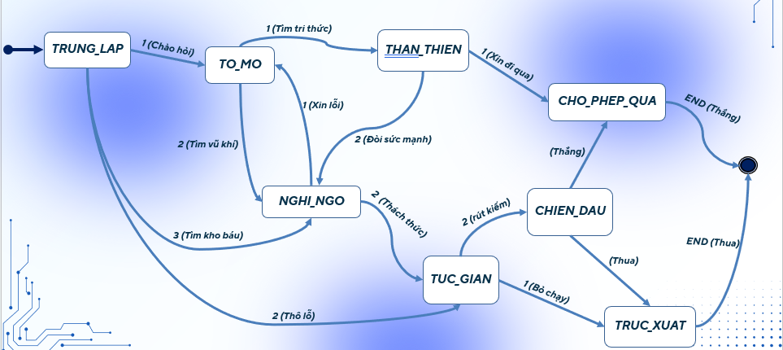

# 🎮 FSM Hunter — Enemy AI với Finite Automata

> Bài tập kết thúc môn học: Ứng dụng Finite Automata vào lập trình game 2D

---

## 📖 Giới thiệu

**FSM Hunter** là game 2D top-down shooter được xây dựng bằng Python và Pygame, trong đó hệ thống thoại của trò chơi được mô hình hóa hoàn toàn bằng một dạng Deterministic Finite Automaton (DFA).


---

## 🧠 Lý thuyết Finite Automata

### Định nghĩa hình thức

Một DFA được định nghĩa bởi bộ 5 thành phần:

```
M = (Q, Σ, δ, q₀, F)
```
    Q (tập các trạng thái):  {TRUNG_LAP, TO_MO, NGHI_NGO, THAN_THIEN, TUC_GIAN, CHIEN_DAU, CHO_PHEP_QUA, TRUC XUAT} 

    𝝈 (Các lựa chọn): {1, 2, 3}

    𝜹 (Hàm chuyển trạng thái):  Được định nghĩa qua bảng lựa chọn trong code.

    q0 (Trạng thái bắt đầu):  TRUNG_LAP

    F (Tập trạng thái kết thúc):  {CHO_PHEP_QUA, TRUC_XUAT}


### Đồ thị chuyển trạng thái (State Transition Diagram)
---


## 🕹️ Gameplay

- Di chuyển nhân vật người chơi bằng phím `WASD` hoặc các phím mũi tên
- Bắn đạn bằng chuột (click trái)
- Né tránh và tiêu diệt các kẻ địch
- Mỗi kẻ địch hiển thị trạng thái FSM hiện tại phía trên đầu (debug mode)
- Mục tiêu: lấy kho báu

---

## 🗂️ Cấu trúc thư mục

```
game_automata_project/
├── assets/                 # Chứa toàn bộ tài nguyên tĩnh
│   ├── graphics/           # Hình ảnh, sprite, tileset
│   └── audio/              # Âm thanh, nhạc nền
├── src/                    # Chứa mã nguồn chính của game
│   ├── automata/           # Module chứa logic xử lý DFA/NFA độc lập
│   │   ├── __init__.py
│   │   ├── state.py        # Định nghĩa State
│   │   └── fsm.py  # Xử lý Transition và validate logic
│   ├── entities/           # Các đối tượng trong game (Player, Enemy...)
│   │   ├── __init__.py
│   │   ├── player.py
│   │   └── enemy.py        # Import dfa_machine.py vào đây để xử lý AI
│   ├── core/               # Vòng lặp game, quản lý màn hình
│   │   ├── __init__.py
│   │   ├── settings.py     # Các hằng số (Kích thước màn hình, FPS...)
│   │   └── game.py         # Chứa Game Loop chính
│   └── main.py             # File chạy đầu vào của chương trình
├── tests/                  # Script test logic của Automata (Rất ăn điểm)
├── .gitignore              # Bỏ qua các file rác của Python/Hệ điều hành khi push lên GitHub
├── requirements.txt        # Danh sách thư viện cần cài (vd: pygame==2.5.2)
└── README.md               # Tài liệu hướng dẫn
---

## ⚙️ Yêu cầu hệ thống

- Python 3.10 trở lên
- pygame 2.x
- pytest (để chạy test)

---

## 🚀 Cài đặt và chạy

Cài đặt thư viện cần thiết
pip install -r requirements.txt

Khởi chạy game
python src/main.py


## 🎓 Liên hệ lý thuyết — Thực tiễn

## 👤 Thông tin tác giả

- **Họ tên:** [Nguyễn Minh Kiên B2407585] [Huỳnh Nguyễn Tấn Khôi B2407584]
- **Môn học:** Tin Học Lý Thuyết / CT121
- **Giảng viên:** [Phạm Xuân Hiền]
- **Năm học:** 2025 – 2026

---

## 📄 Giấy phép

Dự án học thuật — chỉ dùng cho mục đích học tập.
